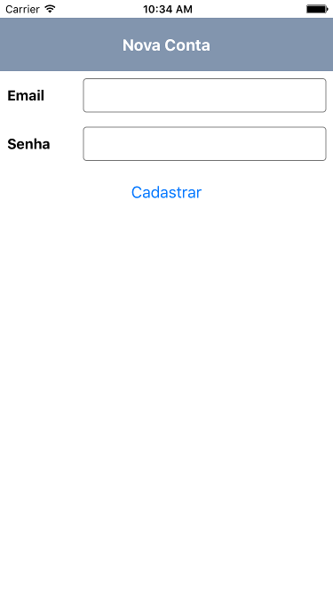
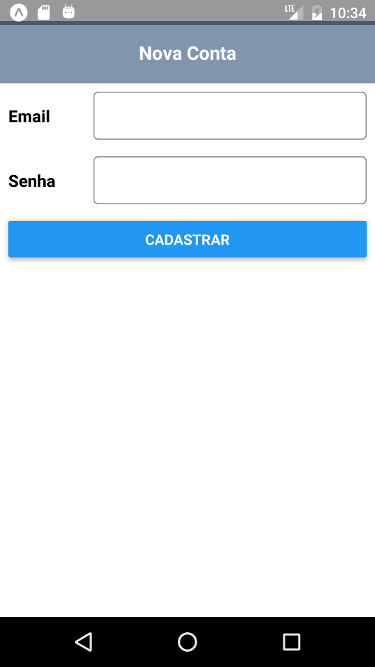

# Formulário de Cadastro

## Screenshots

## Table of Contents

- [Formulário de Cadastro](#formul%C3%A1rio-de-cadastro)
  - [Screenshots](#screenshots)
  - [Table of Contents](#table-of-contents)
  - [Available Scripts](#available-scripts)
    - [`npm start` or `yarn start`](#npm-start-or-yarn-start)
      - [`npm run ios`](#npm-run-ios)
      - [`npm run android`](#npm-run-android)
      - [`json-server --watch db.json`](#json-server---watch-dbjson)

## Available Scripts

If Yarn was installed when the project was initialized, then dependencies will have been installed via Yarn, and you should probably use it to run these commands as well. Unlike dependency installation, command running syntax is identical for Yarn and NPM at the time of this writing.

### `npm start` or `yarn start`

Runs your app in development mode.

#### `npm run ios`

Like `npm start`, but also attempts to open your app in the iOS Simulator if you're on a Mac and have it installed.

#### `npm run android`

Like `npm start`, but also attempts to open your app on a connected Android device or emulator. Requires an installation of Android build tools.

#### `json-server --watch db.json`
Like `json-server --watch db.json`, to run a fake api. 
